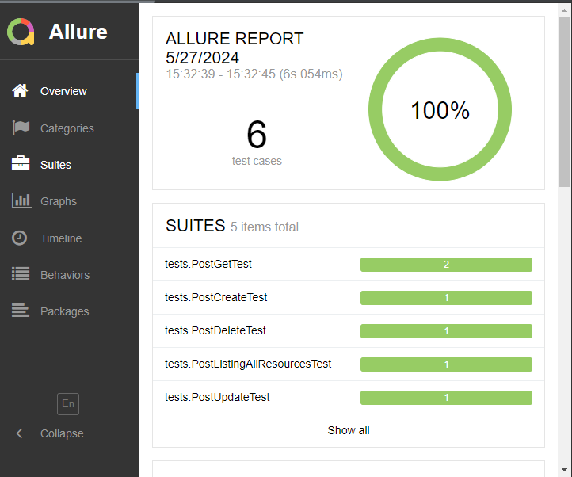

# Project README

## Project Configuration
This project is configured to use Java with JUnit, RestAssured and Allure for testing and reporting. Below are the key configurations and dependencies used in this project.

### Plugins
The project uses the following plugins:
```
plugins {
    id("java")
    id("io.qameta.allure") version "2.11.2"
}
```
### Java version
```
java {
    sourceCompatibility = JavaVersion.VERSION_17
    targetCompatibility = JavaVersion.VERSION_17
}
```
### Dependency Versions
```
val junitVersion = "5.10.0"
val restAssuredVersion = "5.4.0"
val allureVersion = "2.25.0"
```
### Running Tests and Generating Reports

To run tests and generate Allure reports, use the following command:
```
./gradlew test
```
Viewing the Allure report is possible through the IDE or Web-Browser view .index file:
```
build/reports/allure-report/allureReport
```
